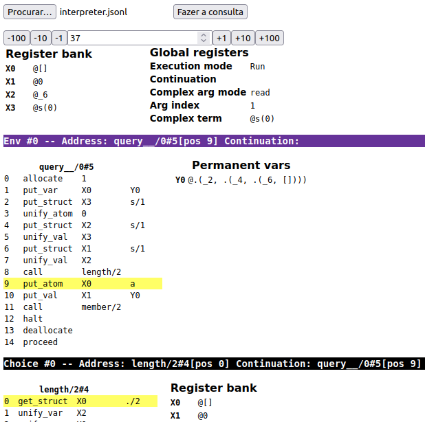

# Prol: WAM demo

This is a simplified Warren Abstract Machine (WAM) implementation for Prolog, that showcases
the main instructions, compiling, register allocation and machine functions.

## Code organization

- model.py: Data objects representing terms, programs, and machine entities.
- compiler.py: Compiling of a list of rules into a list of instructions.
- interpreter.py: Interpreter that execute the instruction listing for a given query.
- grammar.py: Sample application of interpreter, with a grammar that can parse itself.
  Try it out with `python -m grammar` and compare with the text in the file!

## Debug viewer

After creating a `Machine()` object, you may set its `debug_filename` attribute with the
name of a file where it [writes the machine's internal state](https://twitter.com/thingskatedid/status/1386077306381242371)
as a JSON for each iteration.
You may visualize the execution by running an HTTP server within the debug/ folder, e.g.
with `python -m http.server`, and loading the JSONL file.
As a sample, `debugtest/interpreter.jsonl` contains the execution for `interpreter.py`.

## Documentation

1. [About Prolog](docs/about-prolog.md): a hurried primer if you don't know what it is about.
1. [Resolution strategy](docs/resolution.md): how a query is actually solved in Prolog. 
1. [Warren Abstract Machine](docs/wam.md): details about the implementation attempted here.
1. [Indexing](docs/indices.md): indexing implementation to fast-track some call patterns.
1. [Parsing](docs/parsing.md): explaining basic structures for parsing
1. [Grammar](docs/grammar.md): documentation for the sample application of grammar parsing.
1. [Stuff left out](docs/references.md): what this implementation has simplified from the WAM, and references.

