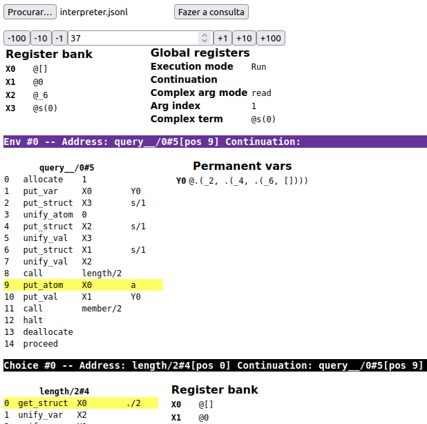

# Prol: WAM demo

Esta é uma implementação simplificada da Máquina Abstrata de Warren (WAM) para Prolog,
que demonstra as principais instruções, compilação, alocação de registros e funções
da máquina.

## Organização do código

- model.py: Objetos de dados, representando termos, programas e entidades da máquina.
- compiler.py: Compilação de uma lista de regras em uma lista de instruções.
- interpreter.py: Interpretador que executa a listagem de instruções para uma dada consulta.
- grammar.py: Uma aplicação de exemplo do interpretador, com uma gramática que parseia a si mesma.
  Teste com `python -m grammar` e compare com o texto no arquivo!

## Visualizador de debug

Após criar um objeto `Machine()`, você pode setar o atributo `debug_filename` com o nome
de um arquivo onde ele vai escrever o estado interno da máquina como um JSON para cada iteração.
Você pode visualizar a execução da máquina rodando um servidor HTTP dentro da pasta debug/,
por exemplo, com `python -m http.server`, e carregando o arquivo JSONL.
Como uma amostra, `debugtest/interpreter.jsonl` contém a execução de `interpreter.py`.

## Documentação

1. [Sobre Prolog](docs.pt-BR/about-prolog.md): uma introdução apressada se você não sabe do que isso se trata.
1. [Estratégia de resolução](docs.pt-BR/resolution.md): como uma consulta é realmente resolvida em Prolog.
1. [Warren Abstract Machine](docs.pt-BR/wam.md): tentativa de explicar a implementação.
1. [Indexando](docs.pt-BR/indices.md): implementação de indexação para acelerar alguns padrões de chamada.
1. [Parsing](docs.pt-BR/parsing.md): explicação das estruturas básicas de parsing.
1. [Gramática](docs.pt-BR/grammar.md): documentação para a aplicação de exemplo de parsing de gramática.
1. [Coisas extras](docs.pt-BR/references.md): o que esta implementação simplificou da WAM, e referências.

